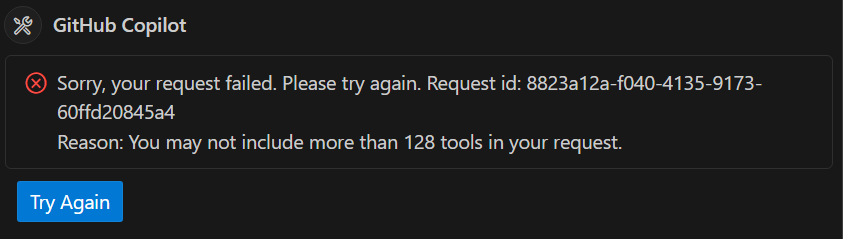

# Troubleshooting

## 128-Tool Limit Issue

### Problem
> [!WARNING]
> Known Issue: "You may not include more than 128 tools in your request"

When configuring Azure MCP with 'all' toolsets for convenience, you may encounter this error:



### Root Cause
VS Code Copilot has a limitation of 128 tools maximum per request. When you combine multiple comprehensive toolsets (like GitHub MCP 'all' + Azure MCP 'all'), the total number of available tools exceeds this limit.

### Workarounds

**Option 1: Use VS Code Custom Chat Modes (Recommended)**
VS Code stable now supports [custom chat modes](https://code.visualstudio.com/docs/copilot/chat/chat-modes#_custom-chat-modes) that allow you to create scenario-specific tool configurations and quickly switch between them:

*Setup Steps:*
1. Install your desired MCP servers (Azure, GitHub, etc.)
2. Create custom chat modes in VS Code for different workflows
3. Switch between modes based on your current task
4. Use the tool picker to discover and add additional tools as needed
5. Stay within the 128-tool limit per mode while maintaining flexibility

> [!NOTE]
> This approach works well once VS Code resolves some current bugs where certain tools don't appear in the picker. This is an evolving feature that provides the best user experience.

**Option 2: Use Selective Tool Loading (Manual Configuration)**
Instead of loading all tools, configure targeted MCP servers for your specific needs:

*Example Configuration:*
```json
{
  "servers": {
    "Azure Storage": {
      "type": "stdio",
      "command": "npx",
      "args": ["-y", "@azure/mcp@latest", "server", "start", "--service", "storage"]
    },
    "Azure KeyVault": {
      "type": "stdio",
      "command": "npx",
      "args": ["-y", "@azure/mcp@latest", "server", "start", "--service", "keyvault"]
    },
    "GitHub Issues": {
      "type": "stdio",
      "command": "npx",
      "args": ["-y", "@modelcontextprotocol/server-github@latest"]
    }
  }
}
```
*Result: ~15-20 tools total instead of 128+*

*Available Azure Services for `--service` flag:*
`storage`, `keyvault`, `cosmos`, `redis`, `servicebus`, `monitor`, `appconfig`, `kusto`, `postgres`, `search`

You can start the server with multiple services by specifying after the `--service` flag, such as `--service storage keyvault`.

**Option 3: Use Dynamic Tool Selection (Alternative Approach)**
Use Azure MCP's dynamic proxy mode - exposes one tool that internally routes to all Azure services:

*Example Configuration:*

```json
{
  "servers": {
    "Azure Dynamic": {
      "type": "stdio",
      "command": "npx",
      "args": ["-y", "@azure/mcp@latest", "server", "start", "--service", "azure"]
    }
  }
}
```

> [!NOTE] 
> This still counts as 1 tool toward the 128 limit, but that 1 tool can access all Azure services. However, if you're combining with GitHub MCP "all" or other comprehensive toolsets, you may still hit the 128-tool limit.

### How to Check Your Tool Count
To see how many tools you're loading:
1. Open VS Code Command Palette (Ctrl+Shift+P)
2. Run "MCP: List Servers"  
3. Check the tool count for each server in the output window

### Future Considerations
VS Code Copilot is planning to address the tool limit in a future update.

## Observability with OpenTelemetry

The server supports observability with [OpenTelemetry](https://opentelemetry.io/).

To export telemetry to an OTLP endpoint set the `OTEL_DISABLE_SDK` environment variable to `false`. By default, when OpenTelemetry is enabled, the
server exports telemetry using the default gRPC endpoint at `localhost:4317`. See the [OTLP exporter documentation](https://github.com/open-telemetry/opentelemetry-dotnet/blob/main/src/OpenTelemetry.Exporter.OpenTelemetryProtocol/README.md) for optional configuration details.

You can try it out locally with the [standalone Aspire dashboard](https://learn.microsoft.com/dotnet/aspire/fundamentals/dashboard/standalone):

```bash
docker run --rm -it -d \
    -p 18888:18888 \
    -p 4317:18889 \
    --name aspire-dashboard \
    mcr.microsoft.com/dotnet/aspire-dashboard:9.0
```

To export telemetry to Azure Monitor, set the `APPLICATIONINSIGHTS_CONNECTION_STRING` environment variable.


## Logging

The Azure MCP Server is instrumented at various levels of detail using the .NET [EventSource](https://learn.microsoft.com/dotnet/api/system.diagnostics.tracing.eventsource) to emit information. Logging is performed for each operation and follows the pattern of marking the starting point of the operation, its completion, and any exceptions encountered. These logs are invaluable for diagnosing issues that may arise from using the Azure MCP Server.

Server logs can be obtained by capturing events for provider "Microsoft-Extensions-Logging".

### Collecting logs with dotnet-trace

`dotnet-trace` is a cross-platform CLI that enables the collection of .NET Core traces. To collect traces:

1. Install [dotnet-trace](https://learn.microsoft.com/dotnet/core/diagnostics/dotnet-trace).
2. Find the process ID for the server, azmcp.exe.
3. Run: `dotnet-trace collect -p {your-process-id} --providers 'Microsoft-Extensions-Logging:4:5'`
4. Collect the trace.
5. A `.nettrace` file will be output.

On Windows, use [PerfView](https://github.com/Microsoft/perfview) to visualize the `.nettrace` file. In other operating systems, `.nettrace` files can be visualized using third party tools.

For more information about using [dotnet-trace](https://learn.microsoft.com/dotnet/core/diagnostics/dotnet-trace) and valid arguments for `--providers`, see: [Logging in .NET Core and ASP.NET Core: Event Source](https://learn.microsoft.com/aspnet/core/fundamentals/logging#event-source) and [Well-known event providers in .NET](https://learn.microsoft.com/dotnet/core/diagnostics/well-known-event-providers)

### Collecting logs with VS Code

By default, VS Code logs informational, warning, and error level messages. To get a detailed view of the interactions between VS Code and Azure MCP Server:

1. Open Command Palette \(Ctrl+Shift+P\).
2. Search for "MCP: List Servers".
3. Select "Azure MCP Server".
4. Select "Show Output".
5. Examine the "Output" window in VS Code.
6. Select "MCP: Azure MCP Server" from the dropdown menu.
7. Click on the "Set Log Level..." icon and choose "Trace" or "Debug".

### Collecting logs with PerfView

[PerfView](https://github.com/Microsoft/perfview) is a free, performance-analysis tool that runs on Windows. To collect traces:

1. Download and open [PerfView](https://github.com/Microsoft/perfview).
2. Select the "Collect" file menu item then "Collect".
3. Find the process ID for the server, azmcp.exe.
4. Select the "Focus process" checkbox. Enter the process ID or executable name, azmcp.exe in the text box.
5. Expand the "Advanced Options" section.
6. In the "Additional Providers" list, add `*Microsoft-Extensions-Logging` to the list. This includes the `*`.
7. Press "Start Collection".

### Visualizing EventSource logs in PerfView

1. Download and open [PerfView](https://github.com/Microsoft/perfview).
2. On the left side, in the file explorer, double-click to expand the `.nettrace` file.
3. Select the "Events" item.
4. Under the Event Types, examine the events under `Microsoft-Extensions-Logging/*`

## Authentication

For comprehensive authentication guidance including advanced scenarios for protected resources, firewall restrictions, and enterprise environments, see our [detailed Authentication guide](https://github.com/Azure/azure-mcp/blob/main/docs/Authentication.md).

### 401 Unauthorized: Local authorization is disabled.

This error indicates that the targeted resource is configured to disallow access using **Access Keys**, which are currently used by Azure MCP for authentication in certain scenarios.

#### Root Cause

Azure MCP currently relies on **access key-based authentication** for some resources. However, many Azure services (e.g., **Cosmos DB**, **Azure Storage**) can be configured to enforce **Azure Entra ID** (formerly AAD) authentication only, thereby disabling local authorization mechanisms such as:

- Primary or secondary access keys
- Shared access signatures (SAS)
- Connection strings containing embedded keys

When these local authorization methods are disabled, any access attempt from Azure MCP using them will result in a `401 Unauthorized` error.

#### Working with Resource Administrators

If you encounter this error in an enterprise environment, work with your resource administrator to:

1. **Verify RBAC Permissions**: Ensure your account has the appropriate data plane roles:
   - For Storage: `Storage Blob Data Reader`, `Storage Blob Data Contributor`, or `Storage Blob Data Owner`
   - For Cosmos DB: `Cosmos DB Built-in Data Reader`, `Cosmos DB Built-in Data Contributor`
   - For Key Vault: `Key Vault Secrets User`, `Key Vault Crypto User`

2. **Confirm Authentication Method**: Ask your administrator:
   - "Is local authentication disabled on this resource?"
   - "What RBAC roles are available for data plane access?"
   - "Should I use user authentication or a service principal?"

3. **Network Considerations**: If the resource is behind a firewall or uses private endpoints:
   - "Are there network restrictions I need to be aware of?"
   - "Do I need VPN access to reach private endpoints?"
   - "What IP addresses should be allowlisted for access?"

### 403 Forbidden: Authorization Failure

This error indicates that the access token used for authentication does not have sufficient permissions to access the requested resource.

#### Possible Causes and Resolutions

- **Insufficient RBAC Permissions**
    Ensure that the service principal or user principal being used for authentication has the appropriate **Role-Based Access Control (RBAC)** permissions assigned at the correct scope (e.g., resource group, subscription, or resource level).

- **Incorrect Subscription or Tenant Context**
    Verify that the subscription and tenant where the resource resides are properly specified during the request. When using an LLM (e.g., via Copilot Chat), provide explicit context such as:

    > List all my storage accounts in subscription `<subscription-id-or-name>`, located in tenant `<tenant-id-or-name>`.

    This ensures the correct token is fetched for the intended tenant and subscription.

- **Unintended Account Being Used for Authentication**
    If you have multiple accounts signed in to your development environment, it's possible that the authentication process is using a different account than intended.
    To ensure the correct account is used, set the following environment variable and restart both your IDE and the MCP server:

    ```bash
    AZURE_MCP_ONLY_USE_BROKER_CREDENTIAL=true
    ```

    This will prompt you to select your desired account and use that to authenticate.


### Network and Firewall Restrictions

Azure MCP Server requires network connectivity to Azure services and authentication endpoints. In enterprise environments with strict network controls, additional configuration may be needed.

#### Common Network Issues

1. **Corporate Firewall Blocking Azure Endpoints**
   - Authentication fails with connection timeout errors
   - Unable to reach `login.microsoftonline.com` or `management.azure.com`

2. **Proxy Server Configuration**
   - HTTP/HTTPS proxy not configured for Azure MCP Server
   - Corporate proxy certificates not trusted

3. **Private Endpoint Connectivity**
   - Resources configured with private endpoints require VPN or ExpressRoute access
   - DNS resolution issues for private endpoint addresses

#### Working with Network Administrators

**Essential Information to Provide:**

1. **Required Endpoints for Authentication:**
   ```
   login.microsoftonline.com:443
   login.windows.net:443
   management.azure.com:443
   graph.microsoft.com:443
   ```

2. **Resource-Specific Endpoints:**
   ```
   Storage: *.blob.core.windows.net:443, *.table.core.windows.net:443
   Key Vault: *.vault.azure.net:443
   Cosmos DB: *.documents.azure.com:443
   Service Bus: *.servicebus.windows.net:443
   ```

3. **Proxy Configuration (if applicable):**
   ```bash
   # Set these environment variables if using a corporate proxy
   export HTTP_PROXY=http://proxy.company.com:8080
   export HTTPS_PROXY=http://proxy.company.com:8080
   export NO_PROXY=localhost,127.0.0.1
   ```

#### Troubleshooting Network Connectivity

1. **Test Basic Connectivity:**
   ```bash
   # Test authentication endpoint
   curl -I https://login.microsoftonline.com
   
   # Test resource management endpoint
   curl -I https://management.azure.com
   ```

2. **Check Private Endpoint DNS Resolution:**
   ```bash
   # Should resolve to private IP (10.x.x.x) if using private endpoints
   nslookup mystorageaccount.blob.core.windows.net
   ```

3. **Verify Certificate Trust:**
   ```bash
   # Check if corporate certificates are trusted
   openssl s_client -connect login.microsoftonline.com:443 -servername login.microsoftonline.com
   ```

#### Questions to Ask Your Network Administrator

- Are there firewall rules blocking outbound HTTPS traffic to Azure endpoints?
- Is a corporate proxy server required for internet access?
- Are there any Conditional Access policies affecting network access?
- Do Azure resources use private endpoints that require VPN access?
- Are corporate CA certificates properly installed and trusted?


### Enterprise Environment Scenarios

Many enterprise environments have additional security controls that can affect Azure MCP Server authentication and operation.

#### Service Principal Authentication for Restricted Environments

In environments where interactive authentication isn't suitable or allowed:

1. **Request Service Principal Creation:**
   Ask your Azure administrator to create a service principal with the following information:
   ```
   Application Name: Azure MCP Server - [Your Name/Team]
   Required Permissions: 
   - Reader role at subscription/resource group level
   - Data plane roles for specific resources (e.g., Storage Blob Data Reader)
   Justification: Development/testing with Azure MCP Server
   ```

2. **Configuration:**
   Once the service principal is created, configure these environment variables:
   ```bash
   export AZURE_CLIENT_ID="service-principal-client-id"
   export AZURE_CLIENT_SECRET="service-principal-secret"
   export AZURE_TENANT_ID="your-tenant-id"
   ```

3. **Certificate-Based Authentication (Preferred):**
   For enhanced security, request certificate-based authentication:
   ```bash
   export AZURE_CLIENT_ID="service-principal-client-id"
   export AZURE_CLIENT_CERTIFICATE_PATH="/path/to/certificate.pem"
   export AZURE_TENANT_ID="your-tenant-id"
   ```

#### Conditional Access Policy Compliance

Organizations may enforce Conditional Access policies that affect authentication:

**Common Policy Requirements:**
- Device compliance (Azure AD joined devices)
- Multi-factor authentication (MFA)
- Location-based restrictions
- Application-specific controls

**Working with Identity Administrators:**

1. **Check Policy Impact:**
   ```
   Questions to ask:
   - Are there Conditional Access policies affecting my authentication?
   - Is my device compliant with organizational policies?
   - Do I need to use a specific authentication method?
   - Can I get an exception for development scenarios?
   ```

2. **Policy Compliance Steps:**
   - Ensure your device is Azure AD joined or hybrid joined
   - Complete device compliance enrollment if required
   - Use compliant authentication methods (avoid saved credentials in non-compliant browsers)
   - Connect from approved network locations if location policies exist

#### Resource Access in Locked-Down Environments

When resources are heavily restricted:

1. **Minimum Required Information to Gather:**
   ```
   Resource Details:
   - Resource names and types
   - Resource group and subscription
   - Whether private endpoints are used
   - Network restrictions (IP allowlists, VNet integration)
   
   Access Requirements:
   - Required RBAC roles
   - Network access requirements
   - Authentication method preferences
   ```

2. **Escalation Path:**
   ```
   Level 1: Resource Administrator
   - Resource-specific permissions
   - RBAC role assignments
   
   Level 2: Network Administrator  
   - Firewall rules and network access
   - Private endpoint connectivity
   
   Level 3: Identity Administrator
   - Conditional Access policies
   - Service principal creation
   ```

### AADSTS500200 error: User account is a personal Microsoft account

This error occurs when trying to authenticate with a personal Microsoft account (@hotmail.com, @outlook.com, @live.com, @gmail.com, etc.) against Azure resources.

#### Why This Happens

Azure MCP Server uses the Azure Identity SDK's `DefaultAzureCredential` for authentication, which requires **Microsoft Entra ID (formerly Azure AD)** credentials to access Azure resources. Personal Microsoft accounts use a different authentication system that isn't compatible with Azure resource access patterns.

See the [Authentication guide](https://github.com/Azure/azure-mcp/blob/main/docs/Authentication.md) for detailed information about supported authentication methods.

#### Resolution Options

**Option 1: Use an Organizational Account (Recommended)**
- Switch to a work or school account that's already part of a Microsoft Entra ID tenant
- Contact your organization's IT administrator to gain access to your company's Azure subscription

**Option 2: Request Access to Existing Azure Subscription**
- Ask your organization to add your existing work account to their Azure subscription
- Learn more: [Add organization users and manage access](https://learn.microsoft.com/azure/devops/organizations/accounts/add-organization-users?view=azure-devops&tabs=browser)

**Option 3: Create a New Azure Subscription with Entra ID Tenant**
- Create a new Azure subscription, which automatically creates a Microsoft Entra ID tenant
- This gives you full control but requires setting up your own Azure environment
- Learn more: [Associate or add an Azure subscription to your Microsoft Entra tenant](https://learn.microsoft.com/entra/fundamentals/how-subscriptions-associated-directory)

**Option 4: Create a Microsoft Entra ID Tenant for Your Personal Account**
- If you must use a personal account, create a new Microsoft Entra ID tenant first
- Then associate your Azure subscription with this tenant
- Learn more: 
  - [Quickstart: Create a new tenant in Microsoft Entra ID](https://learn.microsoft.com/entra/fundamentals/create-new-tenant)
  - [Set up a new Microsoft Entra tenant](https://learn.microsoft.com/entra/identity-platform/quickstart-create-new-tenant)

#### Next Steps
1. Choose the option that best fits your scenario
2. Complete the authentication setup as described in the [Authentication guide](https://github.com/Azure/azure-mcp/blob/main/docs/Authentication.md)
3. Verify access by running `az account show` to confirm you're authenticated with the correct account type

## Development in VS Code

### Use your own language model key

Follow the instructions in [Bring your own language model key](https://code.visualstudio.com/docs/copilot/language-models#_bring-your-own-language-model-key) docs to utilize your API Keys for the language model providers you already have in VS Code.

## Common issues

### Console window is empty when running Azure MCP Server

By default, Azure MCP Server communicates with MCP Clients via standard I/O. Any logs output to standard I/O are subject to interpretation from the MCP Client. See [Logging](#logging) on how to view logs.

### Can I select what tools to load in the MCP server?

Yes, you can enable multiple MCP servers only loading in the services you care most about.
In this example 2 MCP servers are registered that only expose `storage` and `keyvault` tools.

```json
{
  "servers": {
    "Azure Storage": {
      "type": "stdio",
      "command": "<absolute-path-to>/azure-mcp/src/bin/Debug/net9.0/azmcp[.exe]",
      "args": [
        "server",
        "start",
        "--service",
        "storage"
      ]
    },
    "Azure KeyVault": {
      "type": "stdio",
      "command": "<absolute-path-to>/azure-mcp/src/bin/Debug/net9.0/azmcp[.exe]",
      "args": [
        "server",
        "start",
        "--service",
        "keyvault"
      ]
    }
  }
}
```

### Why does VS Code only show a subset of tools available?

The Azure MCP Server can be run in multiple modes. Review your MCP configuration to ensure the it matches your expectations.

- `azmcp server start` - Launches an MCP server with all tools enabled.
- `azmcp server start --service <service-name>` - Launches and MCP server with tools for the specified service, ex) `storage`, `keyvault`
- `azmcp server start --service azure` - Launches an MCP server with a single `azure` tool which perform internal dynamic proxy and tool selection.
